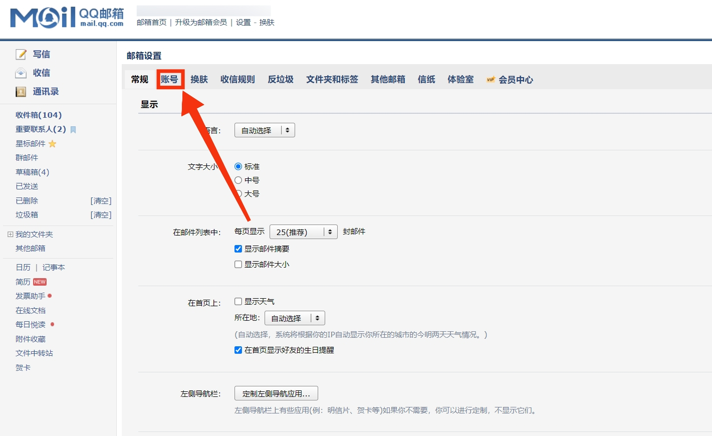
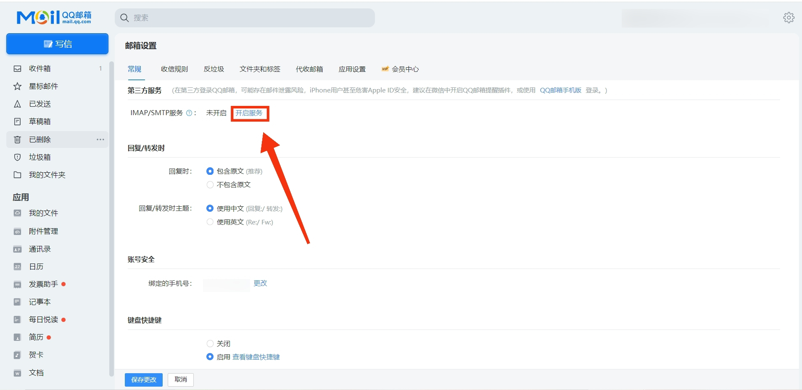

# QQ 邮箱开启 SMTP 服务

>[!NOTE]
SMTP 授权码属于隐私信息，不要将其泄露给他人。也不要将 `email_config` 文件分享给他人。

## SMTP 服务器地址与端口
| **SMTP 服务器地址** | **端口** |
| ------------------- | -------- |
| smtp.qq.com         | 995      |

## SMTP 授权码获取
### 前往官网
QQ 邮箱官网：https://mail.qq.com

（根据 QQ 邮箱的注册时间不同， UI 界面会有一定差异，请自行参照下方教程完成 SMTP 授权码获取。）

### 打开设置
旧 UI ：

新 UI ：


### 点击账号（旧 UI 特有）


### 开启 SMTP 服务
旧 UI :

新 UI ：


### 完成身份验证
根据 QQ 邮箱指引，完成身份验证。

### 复制授权码


## 填写 `email_config` 文件
```
{
    "email_config": {
        "Send_Address": "发件邮箱地址",
        "Send_Password": "发件邮箱SMTP服务授权码",
        "SMTP_Address": "smtp.qq.com",
        "SMTP_Port": 995,
        "Receive_Address": "收件邮箱地址"
    }
}
```