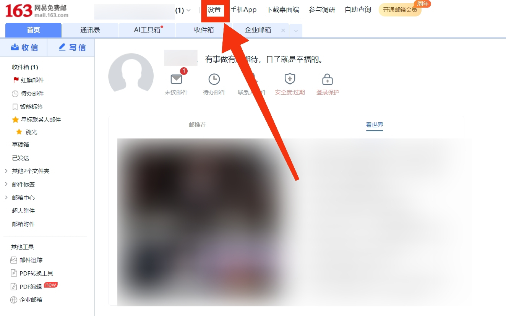
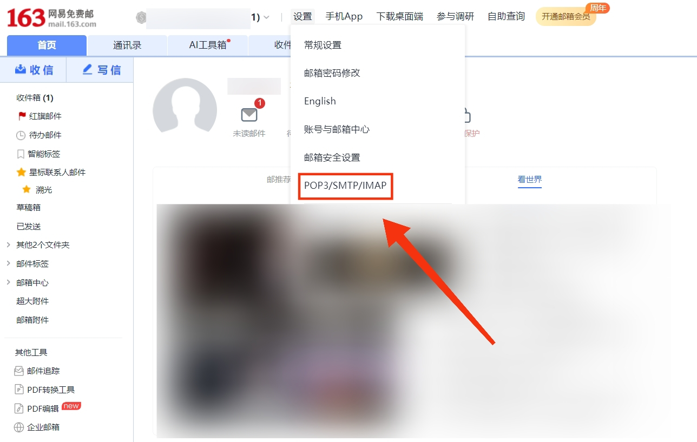
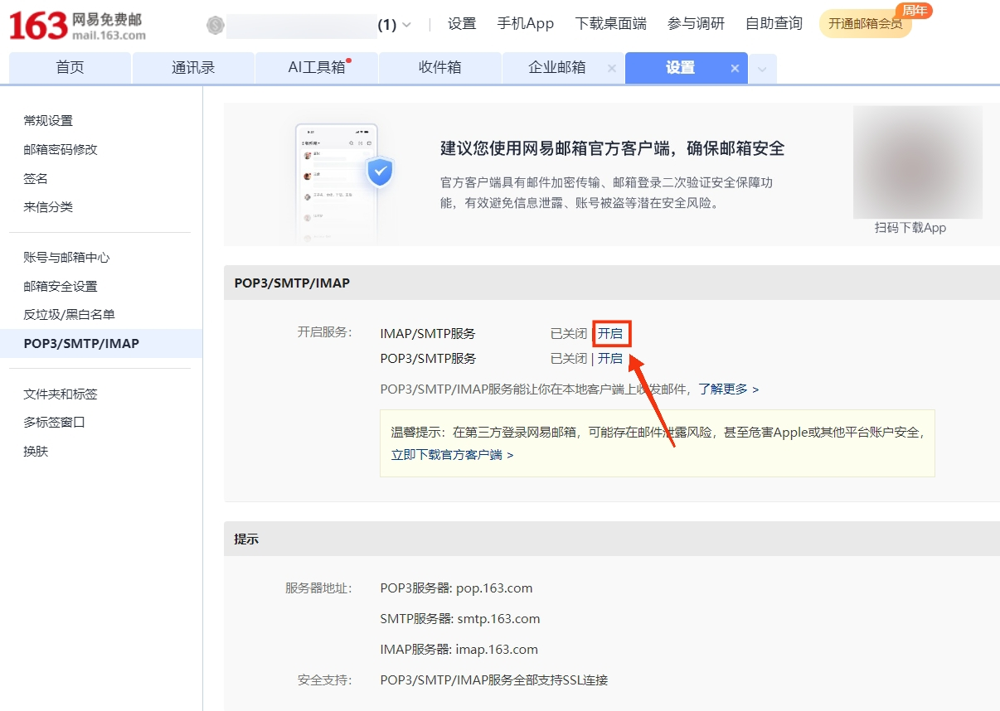
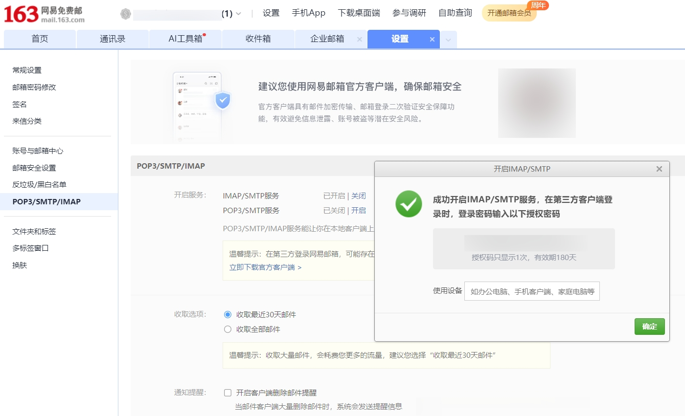

# 网易邮箱开启 SMTP 服务

>[!NOTE]
SMTP 授权码属于隐私信息，不要将其泄露给他人。也不要将 `email_config` 文件分享给他人。

## SMTP 服务器地址与端口
| **SMTP 服务器地址** | **端口** |
| ------------------- | -------- |
| smtp.163.com        | 465/994  |
| smtp.126.com        | 465/994  |

## SMTP 授权码获取
（演示以 163 邮箱为例，126 邮箱等其他网易邮箱请自行参照教程完成。）
### 前往官网
163 邮箱官网：https://mail.163.com

### 点击设置


### 点击 POP3/SMTP/IMAP


### 开启 SMTP 服务
下拉找到 POP3/SMTP/IMAP 。点击开启。


### 完成身份验证
根据 163 邮箱指引，完成身份验证。

### 复制授权码


需要注意的是, 163 邮箱 SMTP 授权码有效期为 180 天，到期后需要重新申请一个新的授权码，并将其填入 `email_config` 文件中。

## 填写 `email_config` 文件
```
{
    "email_config": {
        "Send_Address": "发件邮箱地址",
        "Send_Password": "发件邮箱SMTP服务授权码",
        "SMTP_Address": "smtp.163.com",
        "SMTP_Port": 994,
        "Receive_Address": "收件邮箱地址"
    }
}
```